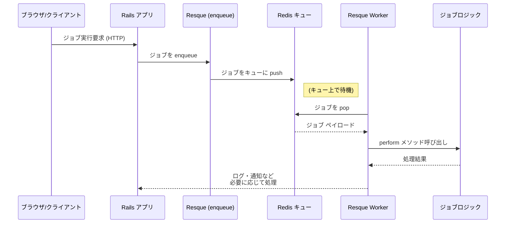

# Resque と Redis のシーケンス

Rails アプリケーションで Resque を用いてジョブを Redis にキューイングし、ワーカーが実行するまでの流れを Mermaid 記法のシーケンス図でまとめます。



Mermaid 対応のビューアやドキュメント生成環境にこのファイルを取り込むことで、ジョブ実行までの全体像を視覚的に把握できます。

queue の priority については QUEUE の name で判断しているらしく、左から書いた順番に優先度が高い。
左から書いたものがなくなったら次のものを探しにいく

    config.active_job.queue_adapter = :resque

を application.rb に書かないと、active_job を経由して使うことができない。
active_job 経由して使ったほうが Rails の機能をフルに使えて良いのでは？

```
class SampleJob < ApplicationJob
  queue_as :sample_queue

  def perform(name)
    puts "Hello, #{name}!"
    puts "perform: #{name}"
    puts "class: #{name.class}"
    puts "has superclass: #{name.respond_to?(:superclass)}"
    puts "superclass: #{name.class.superclass}"
    puts "has ancestors: #{name.respond_to?(:ancestors)}"
    puts "ancestors: #{name.class.ancestors}"
    sleep 5
    puts "SampleJob completed"
  end
end
```

active-job を経由すると少し遅くなってるね。

retry の機構があるらしいが、active job 使ってもダメらしい
resque-schedular がないと？resque-retry とか
あとエラーハンドリング

特に気になるのは

- error-handling
- retry

retry をしたい場合は
resque-retry と resque-schedular を入れる必要あり

retry を使うためには以下

```
require 'resque-retry'

class RetryNonAjJob
  extend Resque::Plugins::Retry
  @queue = :retry_queue

  @retry_limit = 3
  @retry_delay = 10.seconds
```

extend する必要がある。

また rake にも schedular のものを追加する必要がある。

```
resque.rake
require 'resque/scheduler/tasks'
```

これを入れると rake タスクに rake resque:schedular が追加される

これを worker と同時に別プロセスとして実行すると retry が機能する

retry はできなくはないけど、ここまでして使う動機がわからない。

ちなみに schedular は主に遅延実行目的で使用される。

retry もある意味失敗したら行われる遅延実行であるので schedular が使われる

ということで納得。
