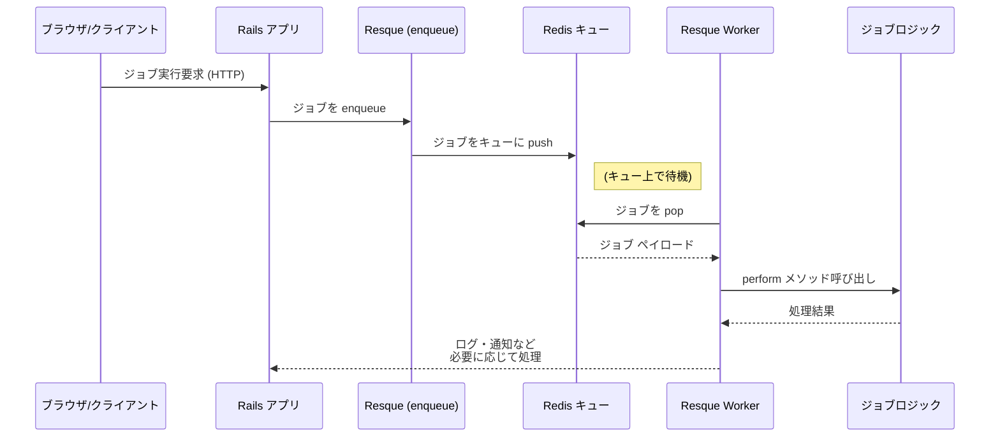

# Resque と Redis のシーケンス

Rails アプリケーションで Resque を用いてジョブを Redis にキューイングし、ワーカーが実行するまでの流れを Mermaid 記法のシーケンス図でまとめます。

```mermaid
sequenceDiagram
    participant Client as ブラウザ/クライアント
    participant Rails as Rails アプリ
    participant Resque as Resque (enqueue)
    participant Redis as Redis キュー
    participant Worker as Resque Worker
    participant Job as ジョブロジック

    Client->>Rails: ジョブ実行要求 (HTTP)
    Rails->>Resque: ジョブを enqueue
    Resque->>Redis: ジョブをキューに push
    note right of Redis: (キュー上で待機)
    Worker->>Redis: ジョブを pop
    Redis-->>Worker: ジョブ ペイロード
    Worker->>Job: perform メソッド呼び出し
    Job-->>Worker: 処理結果
    Worker-->>Rails: ログ・通知など<br/>必要に応じて処理
```

Mermaid 対応のビューアやドキュメント生成環境にこのファイルを取り込むことで、ジョブ実行までの全体像を視覚的に把握できます。

